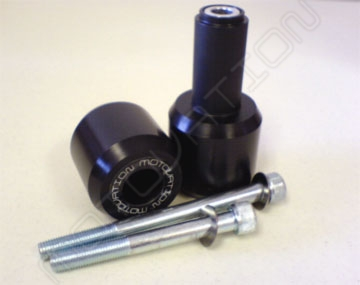

I recently purchased a full set of Motovation sliders for my motorcycle in preparation for a 2-day track day trip to the Phillip Island Grand Prix circuit. I love them, but did face a few issues during the installation process.

### Cut vs. No-Cut Sliders

I chose the cut sliders over the no-cut sliders. My justification for this was answering a few simple questions:

- Are they the most effective design to prevent frame damage? Yes.
- Do they look good? Yes.
- Will I ever take them off after putting them on? No.
- Will it hurt re-sale value? Don't care.
- Do I care about cutting into my fairings? No.

The cut sliders are definitely engineered to protect your frame from damage better than no-cut sliders. They bolt directly into the engine mounts with the high-tensile engine mount bolt being the only weak point... which is a pretty damn good weak point.

No-cut sliders, on the other hand and in my opinion, are an engineering hack... they are generally much more expensive and come with a bracket that is a weak point that is likely to shear off in a crash. They also stick out further from the bike due to having to sit deeper into the bike (below the fairing) to mount onto the bracket and because a majority of the slider is not hidden by the fairing (like with cut sliders).

But all this is just my opinion, if you have a major accident neither the cut or no-cut sliders are likely to protect your frame from damage and will both likely shear off. Having said that, at the Phillip Island track day there was one high-side on a GSXR-750 and the cut sliders did their job and protected the frame from damage. However, this was coming down out of Lukey Heights into MG so this was more of a slow to moderate speed fall.

The Motovation cut sliders are great, I bought them after reading lots of motorcycling forums with many people recommending them. They ship via express post for a moderate fee to Australia. It was fast and painless to get them. They look good and have a nice low-profile shape. Would I buy them again? Yes, most definitely. I actually purchased the Axle and Fork sliders too.

### Installation

#### Tools Required

- Socket set (removal of stuff)
- Screwdriver set (for fairing removal)
- Hex key set (fairing and engine mount bolt removal)
- 9mm drill head (for accurately marking the fairing)
- Driver
- Hole Saw Arbour
- 32mm Hole Saw
- Duct Tape
- Retractable Utility Knife
- Bottle Jack or Scissor Jack (for supporting the engine, preventing potential slipping when one engine mount bolt is out)
- Blue Loctite (or similar)

### Step 1: Right Fairing Removal

### Step 2: Marking and Drilling The Hole

### Step 3: Re-assembly

### Step 4: Slider Installation

### Step 5: Repeat for Left Side

### Problems and Resolution
