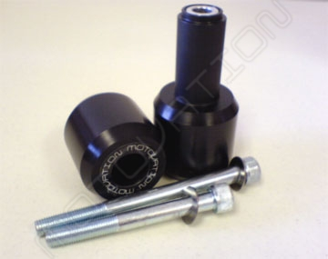
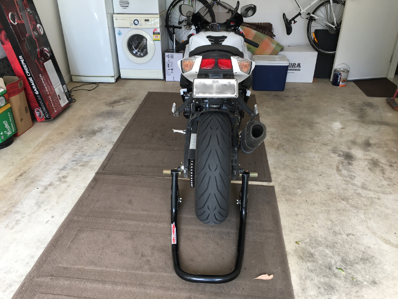
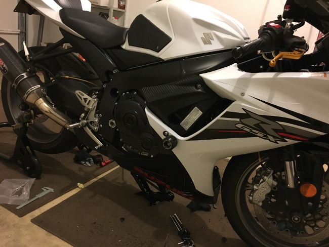
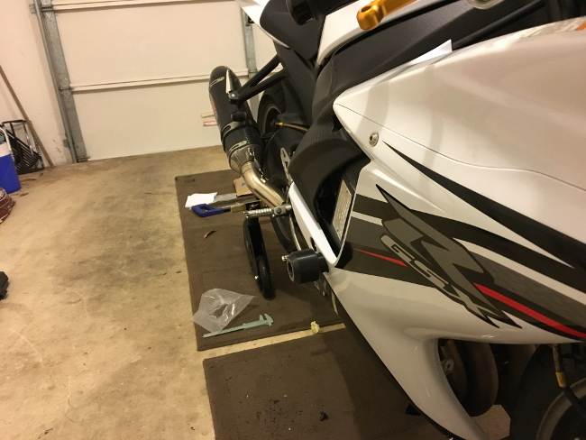
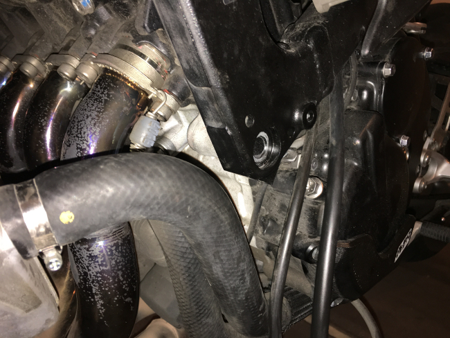
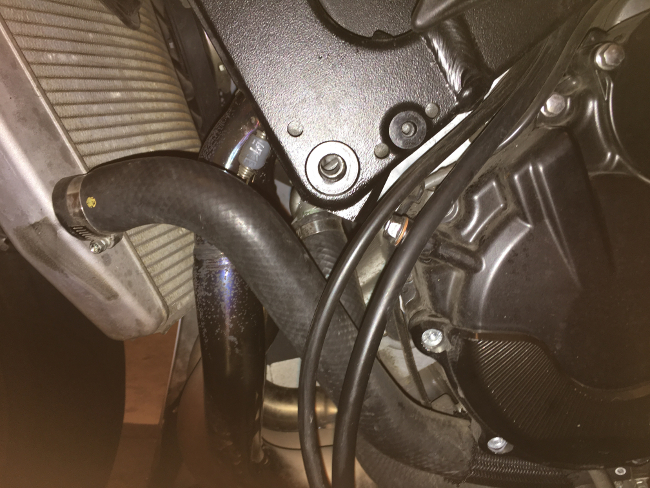
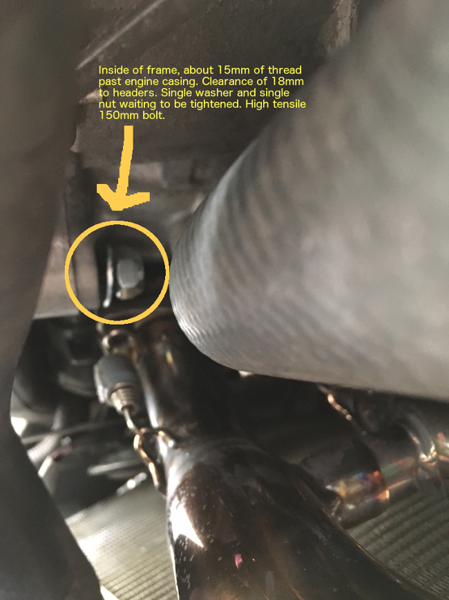

I recently purchased a full set of Motovation sliders for my motorcycle in preparation for a 2-day track day trip to the Phillip Island Grand Prix circuit. I love them, but did face a few issues during the installation process.

### Cut vs. No-Cut Sliders

I chose the cut sliders over the no-cut sliders. My justification for this was answering a few simple questions:

- Are they the most effective design to prevent frame damage? Yes.
- Do they look good? Yes.
- Will I ever take them off after putting them on? No.
- Will it hurt re-sale value? Don't care.
- Do I care about cutting into my fairings? No.

The cut sliders are definitely engineered to protect your frame from damage better than no-cut sliders. They bolt directly into the engine mounts with the high-tensile engine mount bolt being the only weak point... which is a pretty damn good weak point.

No-cut sliders, on the other hand and in my opinion, are an engineering hack... they are generally much more expensive and come with a bracket that is a weak point that is likely to shear off in a crash. They also stick out further from the bike due to having to sit deeper into the bike (below the fairing) to mount onto the bracket and because a majority of the slider is not hidden by the fairing (like with cut sliders).

But all this is just my opinion, if you have a major accident neither the cut or no-cut sliders are likely to protect your frame from damage and will both likely shear off. Having said that, at the Phillip Island track day there was one high-side on a GSXR-750 and the cut sliders did their job and protected the frame from damage. However, this was coming down out of Lukey Heights into MG so this was more of a slow to moderate speed fall.

The Motovation cut sliders are great, I bought them after reading lots of motorcycling forums with many people recommending them. They ship via express post for a moderate fee to Australia. It was fast and painless to get them. They look good and have a nice low-profile shape. Would I buy them again? Yes, most definitely. I actually purchased the Axle and Fork sliders too.

### Installation

#### Tools Required

- Socket set (removal of stuff)
- Screwdriver set (for fairing removal)
- Hex key set (fairing and engine mount bolt removal)
- 9mm drill piece (for accurately marking the fairing)
- Driver
- Hole Saw Arbour
- 32mm Hole Saw
- Masking Tape
- Retractable Utility Knife
- Bottle Jack or Scissor Jack (for supporting the engine, preventing potential slipping when one engine mount bolt is out)
- Blue Loctite (or similar)
- Torque Wrench

### Step 1: Right Fairing Removal

Before you start, if you have a rear stand I highly recommend putting your bike onto the stand. It will make your life a lot easier. A front stand will just get in the way when you try to remove the front fairings.

The first fairing removal is always the hardest. You have to work out how those Japanese engineers have designed the damn things. Surprisingly it wasn't too hard.

You only have to remove the side fairing. There was two hex key screws to remove at the top, a third one in the middle near the engine mount bolt. Once they were removed there was a couple of black tabs on the underside of the front wheel arch to remove which can be removed by pushing down on the center to pop them out. The fairing could then be shifted down from the top and pulled out to semi-expose the underside. Then it was a matter of working around the fairing to remove all the clips on the inside. I found a flat head screwdriver really useful for this.

I recommend just taking your time, don't break any clips. It's not that hard to remove and the fairing is actually really flexible, but the flexibility depends on how old your fairing is (mine is a 2013 model) and how many extreme heat cycles it has been subjected to.  

Unfortunately I didn't take any photos of this procedure as I was tight for time.

### Step 2: Marking and Drilling The Hole

##### Support the engine

First, you will want to support the engine with a bottle jack or scissor jack. This can be done directly underneath the bike on the base of the engine block. Support the engine by making sure it is up firm against the underside but don't jack it up too much, that is not a good time. I found a small block of wood on top of the bottle jack to help here.

##### Marking the fairing
The trick to marking your fairing I found (an idea by an engineering friend of mine) is to use a sharp 9mm drill piece. Remove the right side engine mount bolt and carefully insert the base of the drill piece into the engine mount hole with the pointy end out. If a 9mm drill piece does not work for you, find the largest drill piece you can use so that it can insert and be snug within the bolt hole.

Next, place the fairing back on the bike. You don't have to re-clip everything, just make sure it is in the correct place and has the correct shape to it. I found clipping the top in and replacing all the hex bolts to be sufficient. This takes a little extra time but if you want to get the hole in the right place, this is the best way to align everything properly.

Finally, after the fairing is aligned properly. Simply start turning the drill piece with your hand to mark the underside of the fairing. This will be millimeter perfect and will pay off in the long run. Remove the fairing and drill piece.

##### Drilling the hole

Now it's business time. Warning: Do not drill the hole in your fairing with the fairing on the bike. This will not end well.

With the fairing off the bike, place some masking tape on the paint side of the fairing just around where you will drill the hole. This is not mandatory, but will prevent any un-intentional flaking of the paint while drilling a hole.

Next, secure the fairing. I had someone hold it on a block of wood, but if you are doing it yourself you may be able to kneel or hold it with one hand. With the fairing secured, you want to start to drill out the hole you marked with your driver, slowly increasing the drill piece size as you go. The end game here is to get to the same drill piece size as your arbour which will prevent any slipping from occurring and help centre the hole saw. Mine had a 6.5mm drill piece, so I worked up slowly.

Once I got to the same drill piece size as my arbour. I placed the 32mm hole saw onto the arbour and attached it to the driver. At high RPM I slowly drilled downwards into the underside of the fairing. Patience is the key here, just take your time. It will start to cut into the fairing, keep going deeper until you cut right through and (obviously) stop.

Remove the masking tape. I am a bit OCD so I used a utility knife to finish off the hole to make sure it had no rough edges that could cut into the slider.

### Step 3: Re-assembly

Do not have a brain fade like I did and attach the slider. You have to put the fairing back on your bike first.

Simply reverse the process and re-attach your front fairing. Don't tighten the hex bolts yet.

### Step 4: Slider Installation

Next, attach the slider by pushing it through the fairing. It should fit perfectly with a mm or two clearance on all sides. Remember, you can adjust the position of your fairing a few millimeters while all the hex bolts are loose. Apply a thin line of blue loctite to the new engine mount bolt that comes with the slider. Insert it and tighten to the required torque which for a **2011-2016 GSXR-600** is **40lb/ft**. Use a torque wrench, don't guess it. Don't over-tighten it or you will strip the thread in the engine mount bolt hole. This is a really bad thing as you will see later on, but don't panic if you do. There are solutions.

Finally, tighten the hex bolts for the fairing to hand tightness. Don't over-tighten these either.

Note: Don't remove your bottle/scissor jack yet. You have to do the other side.

### Step 5: Repeat for Left Side

Now it's just a matter of repeating the same process for the left side. The left slider is actually a slightly different shape. This is due to the difference in depth from the fairing to the frame. But once it is installed both will look completely symmetrical.

Unfortunately, my smooth installation process went awry here. I had the fairing off (before cutting a hole) and tested the slider installation by screwing in the bolt into the engine mount hole. I managed to cross thread it a couple of times then thought I had the bolt in properly. About 3/4s of the way in, it cross threaded badly. I knew better than continuing with it and it was a complete noob mistake. I was unable to remove it and it required all my strength, quarter turns at a time to remove the damn thing.

End result - stripped engine mount bolt hole. Not a complete disaster and solvable.

The side-on shot above shows the frame hole, through to the engine mount with the exhaust headers sitting behind.

The shot below shows the stripped engine mount hole, through the frame.

### Problems and Resolution

#### Solution 1 - Re-tapping and re-threading the hole

Being 1 week out from the Phillip Island track day, I initially panicked. But set about re-threading the engine mount hole. This required drilling out the damaged engine mount thread through the frame. Then re-tapping with a [M10 thread tap kit](https://adelaidetools.com.au/prothread-m10-x-1-25-thread-repair-kit.html), and using a helicoil to re-thread the engine mount bolt hole.

I was extremely careful not to touch the frame with the drill piece, going up in size a few mms at a time, using plenty of lubricant in the hole to assist.

Unfortunately, even though I was able to drill out the old thread, the thread tap kit was unable to fit through the engine mount hole into the engine case.

#### Solution 2 - Pivoting the engine down

To re-tap the engine mount bolt hole, the engine must be dropped down below the frame to gain free access to the bolt hole. This process is quite involved, but can be done by un-doing a few engine mounts, removal of the airbox and loosening the bottom engine mount, then pivoting the engine down. To do this you need a special "castle nut" tool to remove the engine mount lock-nuts. This is pretty common on most Japanese motorcycles and the tool can either be made from an old 22-24mm socket and an angle grinder or be bought off eBay from China.

I really didn't have time for either option being 1-week out from my trip, so enter Solution 3.

#### Solution 3 - Replacement high-tensile bolt, washer and self-locking nut

The solution I chose, and what worked well, was to source a replacement high-tensile bolt that was slightly longer and could pass through the slider, frame and engine mount while still having clearance to the exhaust headers. I sourced a 150mm high tensile-bolt from [Fasteners Australia](http://fastenersaustralia.com.au), a couple of washers and lock-nuts. This may, in fact, be stronger than the original engine mount. I bounced a few emails around with my [motorcycle workshop](http://garagemotorcycles.com.au) before doing this.

I also decided at purchase time to get some stud locker, however, using stud locker instead of blue loctite is **NOT** a good idea. You'll never be able to remove the damn thing. The blue loctite is sufficient.

The purpose of the washers is obviously to evenly distribute load across the inside of the engine mount. I don't want to damage the engine block. The lock-nut will help to lock against the engine mount and resist any flex, likewise the high tensile bolt. I applied blue loctite to the thread before tightening the nut. I held the nut on one side with a spanner and then tightened the slider with a torque wrench with hex key head in the other to 40lb/ft.

### Conclusion

My solution to the engine mount problem worked perfectly and resisted vibration, flex and stress at Phillip Island which is probably just about the most it will ever be put under (unless I crash). I do plan on having the engine mount re-threaded at my next visit to the workshop so this is still only a temporary solution. However, it would probably be ok as a permanent solution - it's just that I like things to be done properly.

The slider install was a success, eventually. I'd certainly be more careful next time but I am super happy with the Motovation sliders, they look absolutely fantastic and really enjoyed installing them with a mate of mine. Even though there was a bit of panic with the stripped engine mount bolt hole, coming up with a successful, working solution was quite rewarding.
